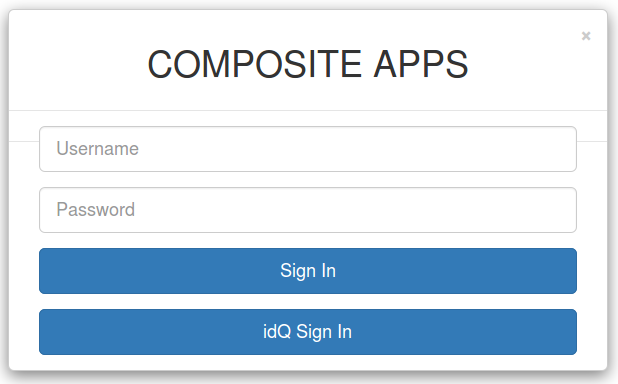
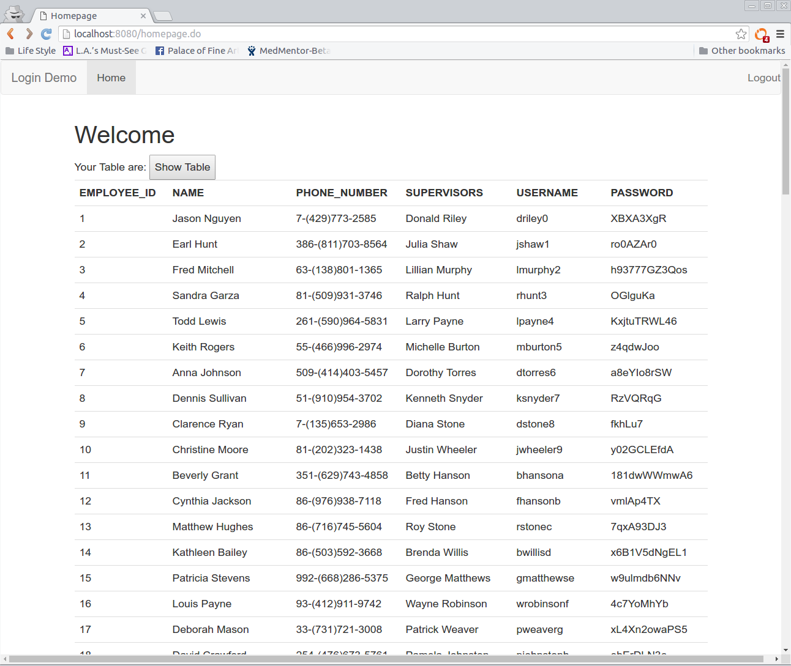

Java Servlet Login and Display
--------------------

Most web apps start with system Login and data Display.

This simple app serves both purposes by Building backend with Tomcat 7 & MySQL 5 for simple Login system and Displaying responsive Data Table with Bootstrap 3. The system login supports OAuth 2.0 authentication as well as username/password authentication.

A user can log in to this simple web application using username/password credential or through a third-party authentication provider such as [idQ Trust as a Service (idQ TaaS)](https://www.inbaytech.com/) or [Google Identity Platform](https://developers.google.com/identity/) via [OAuth 2.0 protocol](https://oauth.net/2/).  

Installation
------------
+ Create MySQL database through script 'createtable_composite.sql' inside 'database' folder.
+ Input MySQL database login credential in 'src/main/java/LoginDao.java'.
+ Input OAuth 2.0 authentication credential in 'src/main/resources/Oauth2.properties'.
+ Execute command "mvn tomcat7:run" to run the standalone web server.

OAuth 2.0 Login Demo
------------
+ Access the link "https://localhost:8443" or "https://your-web-hostname:8443" for OAuth 2.0 login
+ Click idQ Sign In
+ You are redirected to idQ TaaS login screen
+ Scan idQ QR code using your idQ Trusted Device
+ You will be redirected back to reach the home screen of employee information if you have been authenticated by idQ TaaS successfully via OAuth 2.0 protocol.

Version History
---------------

v0.12:

- Fixed closing all database connections after each session use or logout.

v1.01:

- Add OAuth 2.0 login support.

Credit
-------
Basic interview project by http://www.compositeapps.net/

Support
-------
Originally Developed by http://ntt2k.io

OAuth 2.0 support Developed by [winstonhong](https://github.com/winstonhong) @ [inbaytech](https://github.com/inbaytech)
